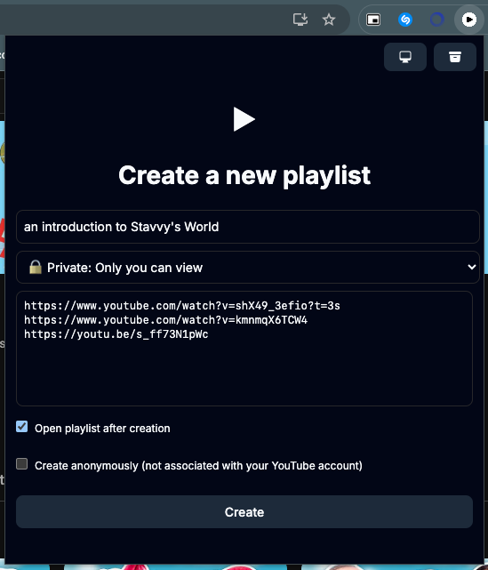
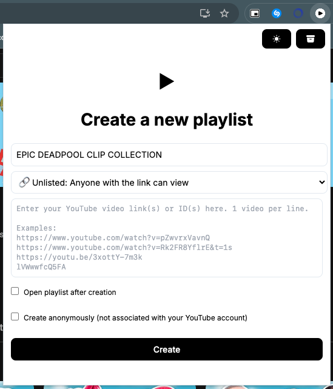
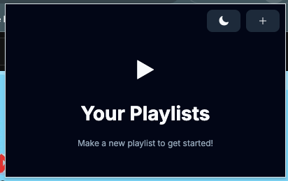

# YouTube Playlist Maker


_The main popup shown in both light and dark mode_
<p align="center">
  
  
</p>


_The additional 'playlists view' for showing playlists created by the extension_
 

## Introduction

YouTube Playlist Maker is a Chrome extension designed to simplify the process of creating YouTube playlists from a list of video URLs.

## Why?

I made this extension to address the personal annoyance of manually adding videos to YouTube playlists. I also couldn't find any existing app / product that could do what I wanted with ease. Given my experience in the world of modern web dev, some familiarity with Chrome extensions and my knowledge of REST APIs, I immediately got to work this festive season

With this extension, anyone can quickly & easily generate playlists by pasting video URLs directly in their browser, quickly saving time and effort.

My extension 
- eliminates the need to add videos one by one **by allowing you paste any amount of links in the popup**
- performs the necessary API call using your own YouTube cookies **allowing personalised playlists to be easily created**
- stores all data within your browser **preventing the need to login into shady, external websites with your Google account**
- only sends data to YouTube to create the playlist & to Google to sync your created playlists in your Chrome profile **allowing your data to stay secure**

## Where can I get it?

As of the date of publishing (10 Jan 2025), I've skimmed through the documentation for publishing on the Chrome Web Store. I saw mention of a registration fee and I am painfully broke so I'll update the repo if I ever publish on there or the Mozilla Add-ons store.

For now, you'll have to build it yourself to run it :)

## How I Did It

This extension leverages modern web technologies and the Chrome Extensions API to provide a seamless user experience. Key features include:

- **React** for building the user interface.
- **TypeScript** for type safety and better code maintainability.
- **Webpack** for bundling the extension.
- **Tailwind CSS** for styling.
- **Chrome Storage API** for saving user data.
- [**shadcn-classless**](https://github.com/fordus/shadcn-classless) for the styled components using classless CSS

## How to Run Locally (For Developers)
### Prerequisites
- [Node.js](https://nodejs.org/en/download) (v20.16 or later, use [nvm](https://github.com/nvm-sh/nvm) to set the specific version)
- [pnpm](https://pnpm.io/) (preferred package manager, but you can use [npm](https://docs.npmjs.com/downloading-and-installing-node-js-and-npm) too if you wanna)

### Setup
#### 1. Clone the repo:
```bash
git clone https://github.com/lkekana/youtube-links-to-playlist.git
cd youtube-links-to-playlist
```

#### 2. Install dependencies:
with pnpm (preferred)
```bash
pnpm install
```

or using npm
```bash
npm install
```

#### 3. Build the project:

for a local build,
```bash
pnpm build
```

#### 4. Load the extension in Chrome:
   - Open Chrome and navigate to [chrome://extensions/](chrome://extensions).
   - Enable "Developer mode" in the top right corner.
   - Click "Load unpacked" and select the `dist` directory.

#### Running in Watch Mode

For development, you can run the project in watch mode to automatically rebuild on file changes:
```bash
pnpm watch
```

## Usage

1. Open the extension popup by clicking the extension icon in the Chrome extension toolbar.
2. Paste your YouTube video URLs into the input box.
3. Click "Create Playlist" to generate a new playlist.

## License

This project is licensed under the GNU General Public License v3.0. See the [LICENSE](./LICENSE) file for details.
